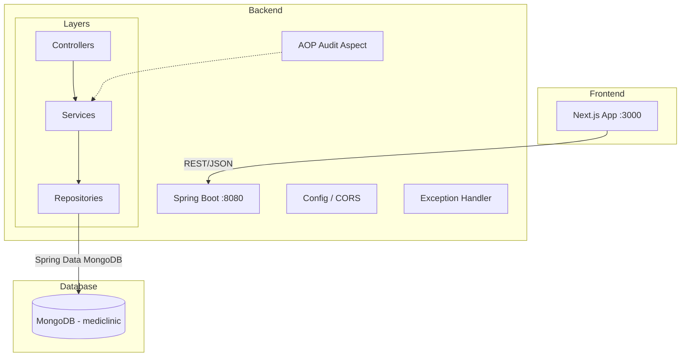
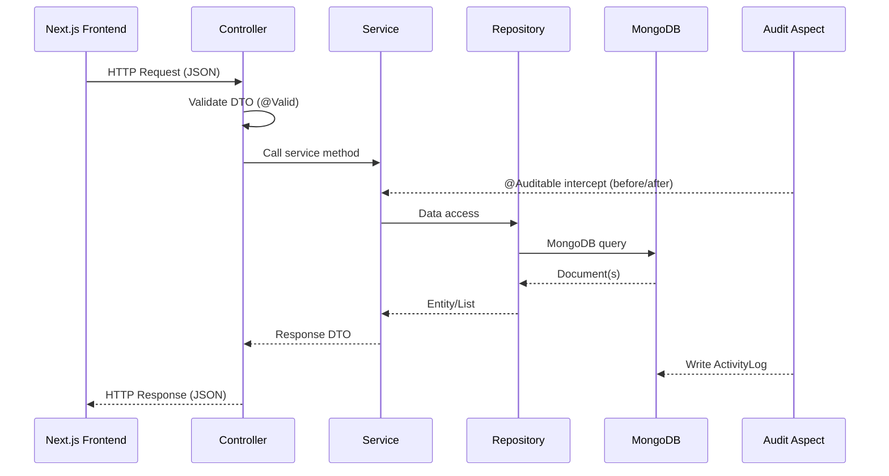

# Design Document: Spring Boot MongoDB Backend

## Overview

This design describes a Spring Boot 3.x REST API backend for the MediClinic Health Records System. The backend replaces hardcoded mock data in the existing Next.js frontend with a persistent MongoDB data layer. It covers patient registration, seven laboratory report types, radiology (X-Ray), ultrasound (UTZ), ECG, medical examinations with auto-calculated BMI, queue management, result releasing with claim number generation, activity logging, and global search.

The API follows a standard layered architecture (Controller → Service → Repository) with Spring Data MongoDB for persistence, Jakarta Bean Validation for input validation, and SpringDoc OpenAPI for documentation. All endpoints are prefixed with `/api` and return JSON. CORS is configured to allow the Next.js frontend (default `http://localhost:3000`) to communicate with the backend.

### Key Design Decisions

1. **Single `data` field with discriminator** — Lab reports use a single MongoDB collection with a `report_type` discriminator and an embedded `data` document whose shape varies by type. This avoids seven separate collections while keeping queries simple via `patient_id` + `report_type` indexes.
2. **Reference ranges as configuration** — Lab reference ranges are defined in a static configuration class (not in the database) since they change infrequently and are identical across all patients. This keeps the validation logic fast and testable without database round-trips.
3. **AOP-based activity logging** — A custom `@Auditable` annotation with an AOP aspect intercepts service-layer methods to automatically create activity log entries, avoiding repetitive logging code in every service method.
4. **Daily auto-increment for queue numbers** — Queue numbers reset daily. A MongoDB `findAndModify` atomic counter document keyed by date ensures thread-safe incrementing without race conditions.
5. **Claim number generation** — Release claim numbers follow the format `CL-{yyyyMMdd}-{sequence}` using the same atomic counter pattern as queue numbers.

---

## Architecture

### High-Level Architecture



### Request Flow



### Package Structure

```
backend/
├── pom.xml
├── src/main/java/com/smartguys/mediclinic/
│   ├── MediclinicApplication.java
│   ├── config/
│   │   ├── CorsConfig.java
│   │   ├── MongoConfig.java
│   │   └── OpenApiConfig.java
│   ├── controller/
│   │   ├── PatientController.java
│   │   ├── LabReportController.java
│   │   ├── RadiologyReportController.java
│   │   ├── UtzReportController.java
│   │   ├── EcgReportController.java
│   │   ├── MedicalExamController.java
│   │   ├── QueueController.java
│   │   ├── ReleasingController.java
│   │   ├── ActivityLogController.java
│   │   ├── SearchController.java
│   │   └── HealthController.java
│   ├── dto/
│   │   ├── request/
│   │   │   ├── PatientRequest.java
│   │   │   ├── LabReportRequest.java
│   │   │   ├── RadiologyReportRequest.java
│   │   │   ├── UtzReportRequest.java
│   │   │   ├── EcgReportRequest.java
│   │   │   ├── MedicalExamRequest.java
│   │   │   ├── QueueEntryRequest.java
│   │   │   ├── StatusUpdateRequest.java
│   │   │   └── ReleaseRequest.java
│   │   └── response/
│   │       ├── PatientResponse.java
│   │       ├── LabReportResponse.java
│   │       ├── RadiologyReportResponse.java
│   │       ├── UtzReportResponse.java
│   │       ├── EcgReportResponse.java
│   │       ├── MedicalExamResponse.java
│   │       ├── QueueEntryResponse.java
│   │       ├── ReleaseRecordResponse.java
│   │       ├── ActivityLogResponse.java
│   │       ├── SearchResultResponse.java
│   │       ├── ErrorResponse.java
│   │       └── PagedResponse.java
│   ├── exception/
│   │   ├── GlobalExceptionHandler.java
│   │   ├── ResourceNotFoundException.java
│   │   ├── ValidationException.java
│   │   └── ConflictException.java
│   ├── model/
│   │   ├── Patient.java
│   │   ├── LabReport.java
│   │   ├── RadiologyReport.java
│   │   ├── UtzReport.java
│   │   ├── EcgReport.java
│   │   ├── MedicalExam.java
│   │   ├── QueueEntry.java
│   │   ├── ReleaseRecord.java
│   │   ├── ActivityLog.java
│   │   ├── Counter.java
│   │   └── enums/
│   │       ├── ReportType.java
│   │       ├── QueueStatus.java
│   │       ├── Department.java
│   │       ├── ReleaseStatus.java
│   │       ├── ReleaseMethod.java
│   │       ├── ReceiverType.java
│   │       ├── ActionType.java
│   │       ├── ModuleType.java
│   │       └── BmiClassification.java
│   ├── repository/
│   │   ├── PatientRepository.java
│   │   ├── LabReportRepository.java
│   │   ├── RadiologyReportRepository.java
│   │   ├── UtzReportRepository.java
│   │   ├── EcgReportRepository.java
│   │   ├── MedicalExamRepository.java
│   │   ├── QueueEntryRepository.java
│   │   ├── ReleaseRecordRepository.java
│   │   ├── ActivityLogRepository.java
│   │   └── CounterRepository.java
│   ├── service/
│   │   ├── PatientService.java
│   │   ├── LabReportService.java
│   │   ├── ReferenceRangeService.java
│   │   ├── RadiologyReportService.java
│   │   ├── UtzReportService.java
│   │   ├── EcgReportService.java
│   │   ├── MedicalExamService.java
│   │   ├── QueueService.java
│   │   ├── ReleasingService.java
│   │   ├── ActivityLogService.java
│   │   ├── SearchService.java
│   │   └── CounterService.java
│   ├── validation/
│   │   ├── ReferenceRangeConfig.java
│   │   └── BmiCalculator.java
│   └── audit/
│       ├── Auditable.java
│       └── AuditAspect.java
├── src/main/resources/
│   ├── application.yml
│   ├── application-dev.yml
│   ├── application-test.yml
│   └── application-prod.yml
└── src/test/java/com/smartguys/mediclinic/
    └── ...
```

---

## Components and Interfaces

### Controllers (REST Endpoints)

#### HealthController
| Method | Path | Description |
|--------|------|-------------|
| GET | `/api/health` | Returns `{ "status": "UP" }` |

#### PatientController
| Method | Path | Description |
|--------|------|-------------|
| POST | `/api/patients` | Create patient |
| GET | `/api/patients/{id}` | Get patient by ID |
| PUT | `/api/patients/{id}` | Update patient |
| GET | `/api/patients?search=&page=&size=` | List/search patients (paginated) |
| DELETE | `/api/patients/{id}` | Delete patient (if no reports) |

#### LabReportController
| Method | Path | Description |
|--------|------|-------------|
| POST | `/api/patients/{patientId}/lab-reports` | Create lab report |
| PUT | `/api/patients/{patientId}/lab-reports/{id}` | Update lab report |
| GET | `/api/patients/{patientId}/lab-reports?report_type=` | List lab reports (optional type filter) |
| GET | `/api/patients/{patientId}/lab-reports/{id}` | Get specific lab report |

#### RadiologyReportController
| Method | Path | Description |
|--------|------|-------------|
| POST | `/api/patients/{patientId}/xray-reports` | Create X-Ray report |
| PUT | `/api/patients/{patientId}/xray-reports/{id}` | Update X-Ray report |
| GET | `/api/patients/{patientId}/xray-reports` | List X-Ray reports |
| GET | `/api/patients/{patientId}/xray-reports/{id}` | Get specific X-Ray report |

#### UtzReportController
| Method | Path | Description |
|--------|------|-------------|
| POST | `/api/patients/{patientId}/utz-reports` | Create UTZ report |
| PUT | `/api/patients/{patientId}/utz-reports/{id}` | Update UTZ report |
| GET | `/api/patients/{patientId}/utz-reports` | List UTZ reports |
| GET | `/api/patients/{patientId}/utz-reports/{id}` | Get specific UTZ report |

#### EcgReportController
| Method | Path | Description |
|--------|------|-------------|
| POST | `/api/patients/{patientId}/ecg-reports` | Create ECG report |
| PUT | `/api/patients/{patientId}/ecg-reports/{id}` | Update ECG report |
| GET | `/api/patients/{patientId}/ecg-reports` | List ECG reports |
| GET | `/api/patients/{patientId}/ecg-reports/{id}` | Get specific ECG report |

#### MedicalExamController
| Method | Path | Description |
|--------|------|-------------|
| POST | `/api/patients/{patientId}/medical-exams` | Create medical exam |
| PUT | `/api/patients/{patientId}/medical-exams/{id}` | Update medical exam |
| GET | `/api/patients/{patientId}/medical-exams` | List medical exams |
| GET | `/api/patients/{patientId}/medical-exams/{id}` | Get specific medical exam |

#### QueueController
| Method | Path | Description |
|--------|------|-------------|
| POST | `/api/queue` | Create queue entry |
| PATCH | `/api/queue/{id}/status` | Update queue entry status |
| GET | `/api/queue?date=&status=&search=` | List queue entries |
| DELETE | `/api/queue/completed` | Remove completed entries for today |

#### ReleasingController
| Method | Path | Description |
|--------|------|-------------|
| GET | `/api/releasing?status=&search=` | List release records |
| POST | `/api/releasing/{id}/release` | Release results to patient |

#### ActivityLogController
| Method | Path | Description |
|--------|------|-------------|
| GET | `/api/activity-logs?date=&module=&action=&search=&page=&size=` | List activity logs (paginated) |

#### SearchController
| Method | Path | Description |
|--------|------|-------------|
| GET | `/api/search?q=` | Global patient search with report summary |

### Service Layer

#### ReferenceRangeService
Evaluates numeric lab values against configured reference ranges. Returns a `Map<String, String>` of field → flag (`"normal"`, `"abnormal"`, `"critical"`).

#### BmiCalculator
Pure utility class:
- `calculateBmi(double heightCm, double weightKg)` → `double` (weight / (height_m)²)
- `classifyBmi(double bmi)` → `BmiClassification` enum (Underweight < 18.5, Normal 18.5–24.9, Overweight 25.0–29.9, Obese_I 30.0–34.9, Obese_II 35.0–39.9, Obese_III ≥ 40.0)

#### CounterService
Atomic daily counter using MongoDB `findAndModify`:
- `getNextQueueNumber(LocalDate date)` → `int`
- `getNextClaimNumber(LocalDate date)` → `int`

### AOP Audit Aspect

The `@Auditable` annotation is placed on service methods:

```java
@Auditable(action = ActionType.CREATED, module = ModuleType.LABORATORY)
public LabReport createLabReport(String patientId, LabReportRequest request) { ... }
```

The `AuditAspect` intercepts `@Auditable` methods, extracts patient info from the method arguments or return value, and writes an `ActivityLog` document asynchronously.

---

## Data Models

### Patient Document
```json
{
  "_id": "ObjectId",
  "registration_date": "2024-01-15",
  "last_name": "Santos",
  "first_name": "Maria",
  "middle_name": "Cruz",
  "address": "123 Rizal St., Quezon City",
  "contact_number": "+63 917 123 4567",
  "employer": "BDO Unibank",
  "birthdate": "1990-03-22",
  "marital_status": "Married",
  "gender": "Female",
  "nationality": "Filipino",
  "created_at": "2024-01-15T08:00:00Z",
  "updated_at": "2024-01-15T08:00:00Z"
}
```

### LabReport Document (single collection, discriminated by report_type)
```json
{
  "_id": "ObjectId",
  "patient_id": "ObjectId-ref",
  "report_type": "Hematology",
  "result_date": "2024-06-01",
  "data": {
    "rbc": 5.0, "hemoglobin": 140, "hematocrit": 0.42,
    "platelet": 250, "wbc": 7.0,
    "neutrophil": 60, "lymphocyte": 30, "monocyte": 5,
    "eosinophil": 2, "basophil": 0, "others_diff": ""
  },
  "is_normal": true,
  "remark": "",
  "flags": {
    "rbc": "normal", "hemoglobin": "normal", "hematocrit": "normal",
    "platelet": "normal", "wbc": "normal"
  },
  "created_at": "2024-06-01T10:00:00Z",
  "updated_at": "2024-06-01T10:00:00Z"
}
```

#### Lab Report Data Shapes by Type

**Urinalysis `data`:**
| Field | Type | Notes |
|-------|------|-------|
| color | String | Yellow, Amber, Dark Yellow, etc. |
| transparency | String | Clear, Slightly Turbid, Turbid, Cloudy |
| specific_gravity | String | e.g. "1.010" |
| ph | String | e.g. "6.0" |
| glucose | String | Negative, Trace, +1..+4 |
| protein | String | Negative, Trace, +1..+4 |
| wbc | String | e.g. "0–2" |
| rbc | String | e.g. "0–2" |
| epithelial | String | None, Few, Moderate, Many, Loaded |
| mucus | String | None, Few, Moderate, Many, Loaded |
| bacteria | String | None, Few, Moderate, Many, Loaded |
| amorphous_urates | String | None, Few, Moderate, Many, Loaded |
| amorphous_phosphates | String | None, Few, Moderate, Many, Loaded |
| others | String | Free text |

**Hematology `data`:**
| Field | Type | Reference Range |
|-------|------|-----------------|
| rbc | Double | M: 4.5–5.5, F: 4.0–5.0 (×10⁶/µL) |
| hemoglobin | Double | M: 140–175, F: 120–155 (g/L) |
| hematocrit | Double | M: 0.42–0.52, F: 0.37–0.47 |
| platelet | Double | 150–400 (×10³/µL) |
| wbc | Double | 5.0–10.0 (×10³/µL) |
| neutrophil | Double | 50–70% |
| lymphocyte | Double | 20–40% |
| monocyte | Double | 2–8% |
| eosinophil | Double | 1–4% |
| basophil | Double | 0–1% |
| others_diff | String | Free text |

**Chem10 `data`:**
| Field | Type | Unit | Reference Range |
|-------|------|------|-----------------|
| fbs | Double | mmol/L | 3.9–6.1 |
| bun | Double | mmol/L | 2.5–7.1 |
| uric_acid | Double | µmol/L | M: 202–416, F: 143–339 |
| creatinine | Double | µmol/L | M: 62–115, F: 53–97 |
| cholesterol | Double | mmol/L | < 5.18 |
| triglyceride | Double | mmol/L | < 1.70 |
| hdl | Double | mmol/L | > 1.04 |
| ldl | Double | mmol/L | < 3.36 |
| vldl | Double | mmol/L | 0.26–1.04 |
| sgpt | Double | U/L | 7–56 |
| sgot | Double | U/L | 10–40 |

**HbA1c `data`:**
| Field | Type | Reference |
|-------|------|-----------|
| hba1c | Double | Normal < 5.7, Pre-Diabetic 5.7–6.4, Diabetic ≥ 6.5 |

**Serology `data`:**
| Field | Type | Notes |
|-------|------|-------|
| rows | Array | Each: `{ test: String, specimen: String, result: String }` |

**Fecalysis `data`:**
| Field | Type |
|-------|------|
| color | String |
| consistency | String |
| wbc | String |
| rbc | String |
| fat_globules | String |
| bacteria | String |
| ova | String |

**BloodTyping `data`:**
| Field | Type | Notes |
|-------|------|-------|
| rows | Array | Each: `{ test: String, specimen: String, result: String }` |

### RadiologyReport Document
```json
{
  "_id": "ObjectId",
  "patient_id": "ObjectId-ref",
  "report_title": "Chest PA (Postero-Anterior)",
  "result_date": "2024-06-01",
  "examination_type": "X-Ray",
  "xray_no": "XR-240601",
  "findings": "The lungs are clear...",
  "impression": "Normal chest PA view.",
  "is_normal": true,
  "created_at": "2024-06-01T10:00:00Z",
  "updated_at": "2024-06-01T10:00:00Z"
}
```

### UtzReport Document
```json
{
  "_id": "ObjectId",
  "patient_id": "ObjectId-ref",
  "report_title": "Whole Abdomen UTZ",
  "result_date": "2024-06-01",
  "examination_type": "Ultrasound",
  "utz_no": "UTZ-240601",
  "findings": "...",
  "impression": "...",
  "is_normal": true,
  "created_at": "2024-06-01T10:00:00Z",
  "updated_at": "2024-06-01T10:00:00Z"
}
```

### EcgReport Document
```json
{
  "_id": "ObjectId",
  "patient_id": "ObjectId-ref",
  "report_title": "12-Lead ECG",
  "result_date": "2024-06-01",
  "examination_type": "ECG",
  "ecg_no": "ECG-240601",
  "findings": "Normal sinus rhythm...",
  "impression": "Normal ECG.",
  "is_normal": true,
  "created_at": "2024-06-01T10:00:00Z",
  "updated_at": "2024-06-01T10:00:00Z"
}
```

### MedicalExam Document
```json
{
  "_id": "ObjectId",
  "patient_id": "ObjectId-ref",
  "result_date": "2024-06-01",
  "height": 158,
  "weight": 55,
  "bmi": 22.03,
  "bmi_classification": "Normal",
  "sa_no": "SA-2024-001",
  "past_medical_history": {
    "conditions": { "Hypertension": false, "Diabetes": false },
    "other_conditions": "",
    "present_illness": "",
    "medications": "",
    "allergies": "",
    "operations": "",
    "smoker": false,
    "alcohol": false,
    "packs_per_day": "",
    "alcohol_years": ""
  },
  "physical_examination": {
    "bp_systolic": 120,
    "bp_diastolic": 80,
    "pulse_rate": 72,
    "respiration": 18,
    "temperature": 36.5,
    "ishihara": "Normal",
    "systems": {
      "Head / Scalp": { "normal": true, "findings": "" },
      "Eyes": { "normal": true, "findings": "" }
    },
    "visual_acuity": {
      "OD (Right)_w/o Glasses": "20/20",
      "OS (Left)_w/o Glasses": "20/20",
      "OU (Both)_w/o Glasses": "20/20"
    },
    "dental_upper_right": "",
    "dental_upper_left": "",
    "dental_lower_right": "",
    "dental_lower_left": "",
    "dental_oral_prophylaxis": false,
    "dental_fillings": false,
    "dental_extraction": false,
    "dental_others": "",
    "attending_dentist": "",
    "lmp": "",
    "ob_score": "",
    "interval": "",
    "duration": "",
    "dysmenorrhea": ""
  },
  "lab_diagnostic_summary": {
    "tests": {
      "Hematology": { "result": "Normal", "status": "Normal" },
      "Urinalysis": { "result": "Normal", "status": "Normal" }
    }
  },
  "evaluation": {
    "evaluation": "A",
    "remarks": "Fit for work",
    "recommendations": "",
    "for_clearance": false
  },
  "created_at": "2024-06-01T10:00:00Z",
  "updated_at": "2024-06-01T10:00:00Z"
}
```

### QueueEntry Document
```json
{
  "_id": "ObjectId",
  "patient_id": "ObjectId-ref",
  "patient_name": "Santos, Maria",
  "employer": "BDO Unibank",
  "department": "laboratory",
  "purpose": "Annual Physical Exam",
  "status": "waiting",
  "queue_number": 1,
  "created_at": "2024-06-01T08:00:00Z",
  "updated_at": "2024-06-01T08:00:00Z"
}
```

### ReleaseRecord Document
```json
{
  "_id": "ObjectId",
  "patient_id": "ObjectId-ref",
  "patient_name": "Santos, Maria",
  "employer": "BDO Unibank",
  "reports": [
    { "id": "lr1", "label": "Urinalysis - 2024-06-01", "done": true },
    { "id": "rr1", "label": "Chest PA - 2024-06-01", "done": true }
  ],
  "status": "ready",
  "release_method": null,
  "released_at": null,
  "received_by": null,
  "receiver_type": null,
  "claim_no": null,
  "created_at": "2024-06-01T10:00:00Z",
  "updated_at": "2024-06-01T10:00:00Z"
}
```

### ActivityLog Document
```json
{
  "_id": "ObjectId",
  "timestamp": "2024-06-01T10:05:00Z",
  "action": "created",
  "module": "Laboratory",
  "patient_name": "Santos, Maria",
  "patient_id": "ObjectId-ref",
  "details": "Created Hematology lab report",
  "user": "lab_tech_01",
  "created_at": "2024-06-01T10:05:00Z"
}
```

### Counter Document (for atomic sequences)
```json
{
  "_id": "queue_2024-06-01",
  "seq": 15
}
```

### MongoDB Indexes

| Collection | Index | Type | Purpose |
|------------|-------|------|---------|
| patients | `{ last_name: "text", first_name: "text", employer: "text" }` | Text | Full-text search |
| lab_reports | `{ patient_id: 1 }` | Single | Patient lookup |
| lab_reports | `{ patient_id: 1, report_type: 1 }` | Compound | Type-filtered queries |
| radiology_reports | `{ patient_id: 1 }` | Single | Patient lookup |
| utz_reports | `{ patient_id: 1 }` | Single | Patient lookup |
| ecg_reports | `{ patient_id: 1 }` | Single | Patient lookup |
| medical_exams | `{ patient_id: 1 }` | Single | Patient lookup |
| queue_entries | `{ created_at: 1, status: 1 }` | Compound | Daily queue queries |
| release_records | `{ patient_id: 1 }` | Single | Patient lookup |
| release_records | `{ status: 1 }` | Single | Status filtering |
| activity_logs | `{ timestamp: -1 }` | Single (desc) | Chronological listing |
| activity_logs | `{ module: 1, action: 1 }` | Compound | Filtered queries |

---


## Correctness Properties

*A property is a characteristic or behavior that should hold true across all valid executions of a system — essentially, a formal statement about what the system should do. Properties serve as the bridge between human-readable specifications and machine-verifiable correctness guarantees.*

### Property 1: Patient round-trip persistence

*For any* valid patient data (with non-empty first_name and last_name), creating a patient via the service and then reading it back by ID should return a patient whose fields (last_name, first_name, middle_name, address, contact_number, employer, birthdate, marital_status, gender, nationality) are equal to the original input (after trimming).

**Validates: Requirements 2.1, 2.2, 2.3**

### Property 2: Patient update round-trip

*For any* existing patient and *any* valid update data, updating the patient and reading it back should return a patient whose fields match the update data (after trimming), and whose `updated_at` is greater than or equal to the original `created_at`.

**Validates: Requirements 2.5, 15.1, 15.2**

### Property 3: Lab report round-trip persistence

*For any* valid lab report (with a valid report_type and result_date), creating the report for an existing patient and reading it back should return a report whose `patient_id`, `report_type`, `result_date`, `data`, `is_normal`, and `remark` fields match the original input.

**Validates: Requirements 3.1, 3.3, 3.7**

### Property 4: Lab report type filtering

*For any* patient with lab reports of mixed types, filtering by a specific `report_type` should return only reports whose `report_type` matches the filter, and the count should equal the number of reports originally created with that type.

**Validates: Requirements 3.6**

### Property 5: Reference range flag correctness

*For any* numeric lab field with a defined reference range and *any* numeric value, the flag returned by the reference range service should be:
- `"normal"` if the value is within the normal range (inclusive)
- `"abnormal"` if the value is outside the normal range but within the critical bounds
- `"critical"` if the value is below the critical low threshold or above the critical high threshold

**Validates: Requirements 4.2, 4.3, 4.4**

### Property 6: BMI calculation and classification

*For any* positive height (in cm, range 50–250) and positive weight (in kg, range 10–300), the calculated BMI should equal `weight / (height / 100)²` (within floating-point tolerance), and the classification should be:
- Underweight if BMI < 18.5
- Normal if 18.5 ≤ BMI < 25.0
- Overweight if 25.0 ≤ BMI < 30.0
- Obese Class I if 30.0 ≤ BMI < 35.0
- Obese Class II if 35.0 ≤ BMI < 40.0
- Obese Class III if BMI ≥ 40.0

**Validates: Requirements 8.6**

### Property 7: Required field whitespace rejection

*For any* string composed entirely of whitespace characters (spaces, tabs, newlines), attempting to use it as a required field value (patient last_name, patient first_name, radiology findings, radiology impression, queue purpose) should be rejected by validation.

**Validates: Requirements 2.8, 5.6, 9.8**

### Property 8: String trimming on persistence

*For any* string input value with leading or trailing whitespace, the value stored in the database and returned in the response should equal the input with leading and trailing whitespace removed (i.e., `input.trim()`).

**Validates: Requirements 13.6**

### Property 9: Patient search case-insensitive partial matching

*For any* existing patient and *any* substring of their last_name, first_name, or employer (in any case variation — upper, lower, mixed), searching with that substring should return a result set that includes that patient.

**Validates: Requirements 2.7, 12.1**

### Property 10: Queue number sequential assignment

*For any* sequence of N queue entries created on the same day, the assigned queue numbers should be the consecutive integers 1 through N with no gaps and no duplicates.

**Validates: Requirements 9.4**

### Property 11: Queue entry sort order

*For any* set of queue entries with mixed statuses, listing them should return entries sorted by status priority (waiting < in-progress < done) and then by queue_number ascending within each status group.

**Validates: Requirements 9.6**

### Property 12: Claim number format and uniqueness

*For any* sequence of N releases performed on the same day, each generated claim number should match the pattern `CL-{yyyyMMdd}-{sequence}` where the date matches the current date, and all claim numbers in the sequence should be unique with strictly increasing sequence numbers.

**Validates: Requirements 10.3**

### Property 13: Release readiness determination

*For any* release record, the status should be `"ready"` if and only if all entries in its `reports` array have `done == true`. If any report has `done == false`, the status should be `"pending"`.

**Validates: Requirements 10.4**

### Property 14: Patient deletion referential integrity

*For any* patient that has at least one associated report (lab, radiology, UTZ, ECG, or medical exam), attempting to delete that patient should fail with a conflict error. *For any* patient with zero associated reports, deletion should succeed.

**Validates: Requirements 15.6**

---

## Error Handling

### Global Exception Handler

A `@RestControllerAdvice` class (`GlobalExceptionHandler`) catches all exceptions and maps them to a consistent JSON error response:

```java
{
  "timestamp": "2024-06-01T10:05:00Z",
  "status": 400,
  "error": "Bad Request",
  "message": "Validation failed",
  "path": "/api/patients",
  "fieldErrors": [
    { "field": "last_name", "rejectedValue": "", "message": "Last name is required" }
  ]
}
```

### Exception Mapping

| Exception | HTTP Status | When |
|-----------|-------------|------|
| `MethodArgumentNotValidException` | 400 | Jakarta Bean Validation fails on `@Valid` DTO |
| `ValidationException` (custom) | 400 | Custom business validation (e.g., invalid report_type) |
| `ResourceNotFoundException` (custom) | 404 | Entity not found by ID |
| `ConflictException` (custom) | 409 | Referential integrity violation (delete patient with reports, release incomplete results) |
| `HttpMessageNotReadableException` | 400 | Malformed JSON or invalid date format |
| `Exception` (catch-all) | 500 | Unexpected errors — log full stack trace, return generic message |

### Validation Strategy

1. **DTO-level validation** — Jakarta Bean Validation annotations (`@NotBlank`, `@NotNull`, `@Pattern`) on request DTOs, triggered by `@Valid` on controller parameters.
2. **Service-level validation** — Business rules that require database lookups (e.g., patient existence check, report type validation, vital sign plausible ranges).
3. **Whitespace trimming** — A custom `StringTrimDeserializer` registered globally via Jackson `ObjectMapper` configuration trims all incoming string fields automatically.
4. **Date validation** — `@Pattern(regexp = "\\d{4}-\\d{2}-\\d{2}")` on date string fields in DTOs, plus `LocalDate.parse()` in the service layer to catch invalid dates like "2024-02-30".

### Error Response Format

All error responses follow the same structure regardless of error type:

```java
public record ErrorResponse(
    Instant timestamp,
    int status,
    String error,
    String message,
    String path,
    List<FieldError> fieldErrors  // null for non-validation errors
) {}

public record FieldError(
    String field,
    Object rejectedValue,
    String message
) {}
```

---

## Testing Strategy

### Testing Approach

The project uses a dual testing approach:

1. **Property-based tests** — Verify universal properties across many generated inputs using **jqwik** (Java property-based testing library for JUnit 5). Each property test runs a minimum of 100 iterations.
2. **Unit tests** — Verify specific examples, edge cases, and error conditions using JUnit 5 + Mockito.
3. **Integration tests** — Verify end-to-end behavior with an embedded MongoDB instance using `@SpringBootTest` + Testcontainers or Flapdoodle embedded MongoDB.

### Property-Based Testing Configuration

- **Library**: jqwik 1.9.x (integrates with JUnit 5 Platform)
- **Minimum iterations**: 100 per property
- **Tag format**: `Feature: spring-boot-mongodb-backend, Property {number}: {title}`

Each correctness property from the design maps to a single property-based test:

| Property | Test Class | What It Generates |
|----------|-----------|-------------------|
| 1: Patient round-trip | `PatientServicePropertyTest` | Random valid patient data |
| 2: Patient update round-trip | `PatientServicePropertyTest` | Random valid update data |
| 3: Lab report round-trip | `LabReportServicePropertyTest` | Random lab reports across all 7 types |
| 4: Lab report type filtering | `LabReportServicePropertyTest` | Mixed-type report sets |
| 5: Reference range flags | `ReferenceRangeServicePropertyTest` | Random numeric values across all lab fields |
| 6: BMI calculation | `BmiCalculatorPropertyTest` | Random height/weight pairs |
| 7: Whitespace rejection | `ValidationPropertyTest` | Whitespace-only strings |
| 8: String trimming | `StringTrimmingPropertyTest` | Strings with leading/trailing whitespace |
| 9: Patient search | `SearchServicePropertyTest` | Random patient names + substrings |
| 10: Queue numbering | `QueueServicePropertyTest` | Random batch sizes |
| 11: Queue sort order | `QueueServicePropertyTest` | Mixed-status queue entries |
| 12: Claim number format | `ReleasingServicePropertyTest` | Random release sequences |
| 13: Release readiness | `ReleasingServicePropertyTest` | Random report completion states |
| 14: Patient deletion integrity | `PatientServicePropertyTest` | Patients with/without reports |

### Unit Test Coverage

Unit tests focus on:
- Specific error cases (404, 409, 400 responses)
- Enum validation (valid/invalid report types, statuses, departments)
- Date format validation (valid ISO dates, invalid formats, impossible dates)
- Edge cases (empty collections, boundary values for reference ranges)
- Controller endpoint integration (MockMvc tests)

### Test Infrastructure

- **JUnit 5** — Test framework
- **Mockito** — Service/repository mocking for unit tests
- **jqwik** — Property-based testing
- **Spring Boot Test** — `@SpringBootTest`, `@WebMvcTest`, `@DataMongoTest`
- **Embedded MongoDB** (de.flapdoodle.embed.mongo) — In-memory MongoDB for integration tests
- **MockMvc** — Controller-level HTTP testing without starting the full server

### Test Organization

```
src/test/java/com/smartguys/mediclinic/
├── property/
│   ├── PatientServicePropertyTest.java
│   ├── LabReportServicePropertyTest.java
│   ├── ReferenceRangeServicePropertyTest.java
│   ├── BmiCalculatorPropertyTest.java
│   ├── ValidationPropertyTest.java
│   ├── StringTrimmingPropertyTest.java
│   ├── SearchServicePropertyTest.java
│   ├── QueueServicePropertyTest.java
│   └── ReleasingServicePropertyTest.java
├── unit/
│   ├── controller/
│   ├── service/
│   └── validation/
└── integration/
    ├── PatientIntegrationTest.java
    ├── LabReportIntegrationTest.java
    └── ...
```
